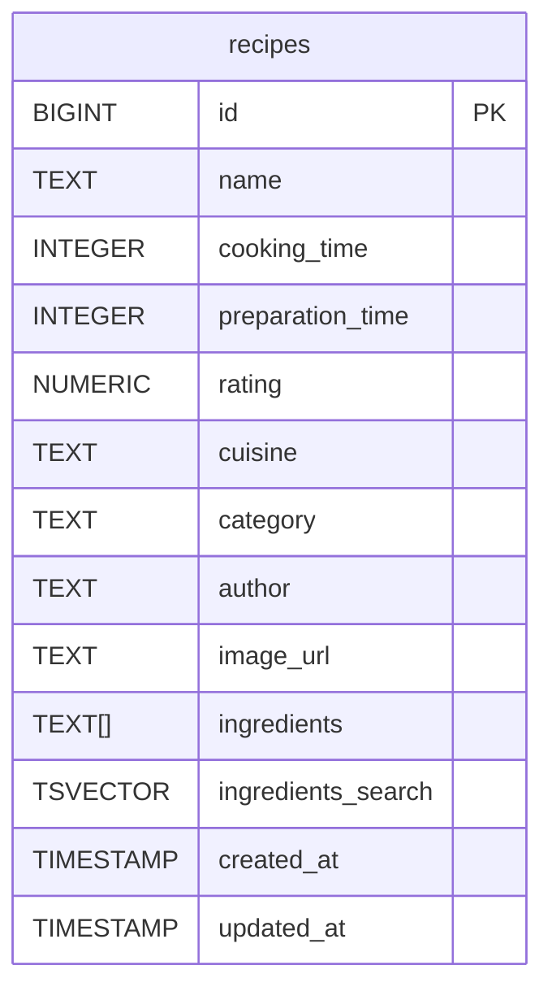

# README

## Getting started

Thanks to Docker everything works out of the box, no setup on your machine is required :

```bash
# Starting the docker compose stack
docker compose up
# Setting up the database
docker compose exec web rails db:setup
```

> :information_source: &nbsp; You can access the application at http://localhost:3000

You can run both frontend and backend tests using Docker too :

```bash
# Running frontend tests
docker compose exec web yarn test
# Running backend tests
docker compose exec web rails spec
```

## User stories

1. As a user, I want a list all recipes, so I can find something I like.

    **Scenario** Get all recipes in a paginated list :

        Given the user arrives on the home page
        When the page is loaded
        Then all recipes are displayed as card with the image, recipe name and rating
        And pagination controls are rendered at the bottom of the list

1. As a user, I want to see a recipe with all its information.

    **Scenario** Displaying recipe details :

        Given the user is on the home page
        When the user clicks on a recipe from the list
        Then the user is redirected on the recipe's page
        And the page displays all information of the clicked recipe

1. As a user, I want to search for recipes by their ingredient names to find a recipe based on the ingredients I have.

    **Scenario** Get all recipes corresponding to ingredients:

        Given the requested name matches an ingredient
        When the user adds or remove ingredient names
        Then the recipes list displays the search results
        And the recipes are ordered by decreasing search rank

## Database

The ingredients are stored in a PostgreSQL array.
A trigger runs a function that is transparently updating the `ingredients_search` tsvector when the `ingredients` array is created or updated.
By taking advantage of the PostgreSQL search features, we can achieve good performance when searching for a recipe by ingredient name.



## Improvements

- Depending of the application's future features, it may make sense to move the ingredients in a separate table.
- As Rails assets pipeline still struggle with SPA javascript (e.g. no hot reloading), it seems to be a good idea move the javascript outside of Rails.
- Using a prebuilt framework like Next would simplify the growth of the application code base.
- URL search params should be used on application mount to allow users to share their search results.
- The API should return JSON:API compliant errors and not html.
